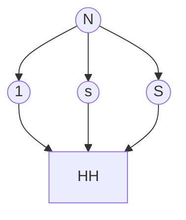
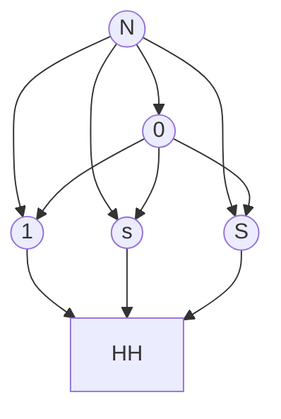
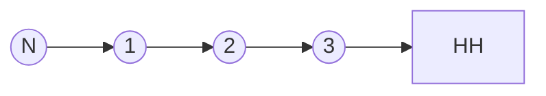
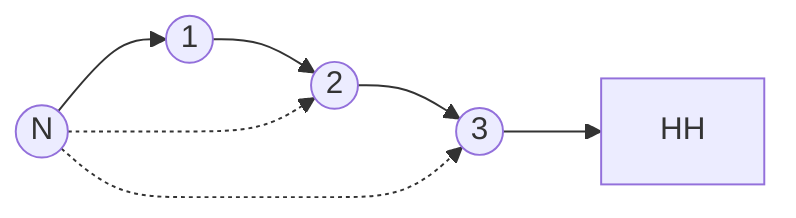
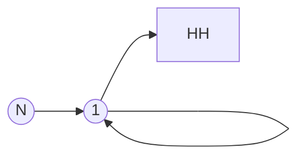

# Examples of Input-Output Networks

> Part: Input-Output Networks and Economic Activity

## Horizontal economy.

Consider an economy with no intermediate inputs. Instead there are
$S$ sectors, each producing a final output directly consumed by the
representative household. With only one input of production and constant
returns to scale we have linear output:
\[
y_{s}\;=\;z_{s}n_{s}.
\]
In terms of the Domar economy developed above, this implies,
\[
a_{sk}=0\qquad\text{for all }s,k,\qquad\alpha_{s}=1.
\]
Hence
\[
\Omega=A=0,\qquad\Psi=I,\qquad\lambda_{s}=\beta_{s}.
\]
There is no propagation across sectors. The sectoral formula collapses
to
\[
d\log y_{s}=d\log z_{s},
\]
and the aggregation formula becomes
\[
d\log Y=\sum_{s=1}^{S}\beta_{s}\,d\log z_{s}.
\]
This is the natural benchmark in which aggregate productivity is just
a weighted average of sectoral productivity. The proper weights are
now value added weights because each sector only produces final goods.

## Economy with a basic input.

Now consider an economy with one additional sector, sector $0$, that
produces a *basic input* using only labor with a linear production
technology. Households do not consume good $0$ directly, but every
sector $s=1,\dots,S$ uses it in production alongside labor with a
Cobb-Douglas technology. The production functions are
\[
y_{0}\,=\,z_{0}n_{0},\quad\text{and}\quad y_{s}\,=\,z_{s}n_{s}^{\alpha_{s}}x_{s0}^{\,1-\alpha_{s}}\quad\text{for}\quad s\,=\,1,\dots,S.
\]
Household preferences are also Cobb-Douglas. Since good $0$ is not
demanded by consumers, we have
\[
\beta_{0}\,=\,0,\qquad\sum_{s=1}^{S}\beta_{s}=1.
\]
In terms of the input-output coefficients,
\[
\alpha_{0}\,=\,1,\qquad a_{s0}\,=\,1-\alpha_{s}\quad\text{for }\;s=1,\dots,S,\qquad a_{sk}\,=\,0\ \text{otherwise}.
\]
Hence, ordering sectors as $(0,1,\dots,S)$,
\[
\Omega\,=\,\begin{bmatrix}0 & 0 & 0 & \cdots & 0\\
1-\alpha_{1} & 0 & 0 & \cdots & 0\\
1-\alpha_{2} & 0 & 0 & \cdots & 0\\
\vdots & \vdots & \vdots & \ddots & \vdots\\
1-\alpha_{S} & 0 & 0 & \cdots & 0
\end{bmatrix}.
\]
There are no input chains longer than one step, because sector $0$
itself uses only labor. Therefore $\Omega^{2}=0$, so the Leontief
inverse collapses to
\[
\Psi\,=\,(I-\Omega)^{-1}\,=\,I+\Omega\,=\,\begin{bmatrix}1 & 0 & 0 & \cdots & 0\\
1-\alpha_{1} & 1 & 0 & \cdots & 0\\
1-\alpha_{2} & 0 & 1 & \cdots & 0\\
\vdots & \vdots & \vdots & \ddots & \vdots\\
1-\alpha_{S} & 0 & 0 & \cdots & 1
\end{bmatrix}.
\]
The basic input affects every final sector, but there is no further
propagation beyond that first round.

Using $\lambda\,=\,(I-\Omega')^{-1}\beta$, we obtain the equilibrium
Domar weights
\[
\lambda_{0}\,=\,\sum_{s=1}^{S}(1-\alpha_{s})\beta_{s},\qquad\lambda_{s}\,=\,\beta_{s},\qquad s\,=\,1,\dots,S.
\]
So the Domar weight of the basic-input sector is its average cost
share across the sectors that are ultimately absorbed in final demand.
The sectoral solutions are
\[
d\log y_{0}\,=\,d\log z_{0},
\]
and, for $s\,=\,1,\dots,S$,
\[
d\log y_{s}\,=\,d\log z_{s}+(1-\alpha_{s})\,d\log z_{0}.
\]
Aggregating,
\[
d\log Y\;=\;\lambda_{0}\,d\log z_{0}\,+\,\sum_{s=1}^{S}\lambda_{s}\,d\log z_{s}\;=\;\left(\sum_{s=1}^{S}(1-\alpha_{s})\beta_{s}\right)d\log z_{0}\,+\,\sum_{s=1}^{S}\beta_{s}\,d\log z_{s}.
\]
Relative to the horizontal economy, shocks to sector $0$ now matter
for aggregate output even though households never consume good $0$
directly. What matters is that every final-good sector uses it as
an input. The economy behaves like a horizontal economy augmented
by one common productivity component, sector $0$, whose aggregate
weight is exactly the weighted expenditure share on the basic input.

## Vertical economy.

Now consider a chain economy in which each sector is an input for
the next, up until the last sector that produces the final good. There
are two useful versions.

**Version A: Labor only at the top of the chain.**

Sector $1$ uses only labor, sector $2$ uses only sector $1$, sector
$3$ uses only sector $2$, and so on. In a three-sector version,
\[
\Omega=\begin{bmatrix}0 & 0 & 0\\
1 & 0 & 0\\
0 & 1 & 0
\end{bmatrix},\qquad\Psi=\begin{bmatrix}1 & 0 & 0\\
1 & 1 & 0\\
1 & 1 & 1
\end{bmatrix},\qquad\lambda=\begin{bmatrix}1\\
1\\
1
\end{bmatrix}.
\]
Every unit of final output requires one unit of each upstream good,
so each sector's gross sales equal GDP. Therefore every productivity
shock receives weight one in aggregation:
\[
d\log Y=d\log z_{1}+d\log z_{2}+d\log z_{3}.
\]
The aggregate technology is, of course,
\[
Y\;=\;\left(\prod_{s=1}^{S}z_{s}\right)N.
\]

**Version B: Labor in every stage.**

Suppose instead that every downstream sector combines labor and the
previous stage with shares $1-\omega$ and $\omega$, respectively.
Then for $s\geq2$,
\[
\alpha_{s}=1-\omega,\qquad a_{s,s-1}=\omega,
\]
with sector $1$ still using only labor. In this case the chain still
implies downstream propagation, but the effect decays geometrically:
\[
\psi_{sk}=\begin{cases}
\omega^{s-k} & \text{if }s\geq k,\\
0 & \text{if }s<k.
\end{cases}
\]
Hence the closer a sector is to final demand, the more heavily it
loads on upstream productivity shocks.

## Roundabout economy.

Finally, consider the one-sector economy with self-use of intermediates.
There is one sector that combines labor and its own output:
\[
y=z\,n^{1-\omega}x^{\omega},\qquad0<\omega<1.
\]
Then
\[
\Omega=[\omega],\qquad\Psi=\frac{1}{1-\omega},\qquad\lambda=\frac{1}{1-\omega}.
\]
The sectoral and aggregate formulas coincide:
\[
d\log y=d\log Y=\frac{1}{1-\omega}\,d\log z.
\]
This is the cleanest example of amplification through intermediate
inputs. The same productivity improvement is more important when the
economy is more roundabout because the good is used repeatedly along
the production chain.
